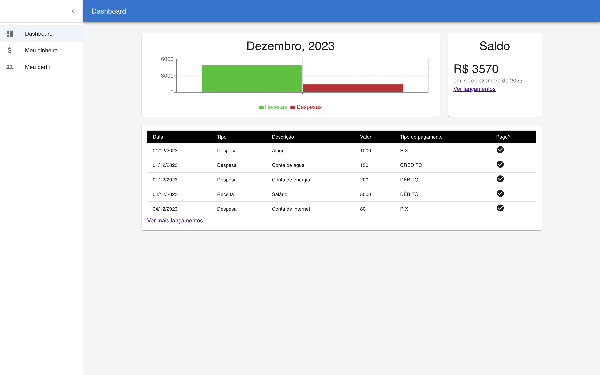

# Expenses App

## Context

This project is developed in order to organize the financial life of a regular person. It aims to address a significant issue that usually everyone faces, which is spending more than you earn.
By recording all your debts, bills and also incomes, we are able to provide a simple, direct to the point, and insightful graphs, as well as keeping a history of all transactions made.

## Tech Used

This project uses a variety of technologies to achieve its goals:

- **React**: A JavaScript library for building user interfaces.
- **TypeScript**: A typed superset of JavaScript that adds static types.
- **Vite**: A build tool that aims to provide a faster and leaner development experience for modern web projects.
- **Material UI**: A popular React UI framework that implements Google's Material Design. It provides a set of reusable, well-tested, and accessible UI components. It's designed to make it easy to build dynamic and beautiful user interfaces in React applications.

## How to run

| The server must be already running

After downloading the project, install its dependencies by executing:

`npm install`

Then just run the dev command in order to make the client server available:

`npm run dev`
